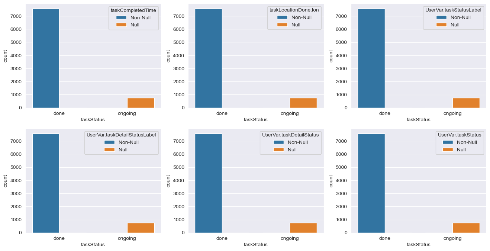
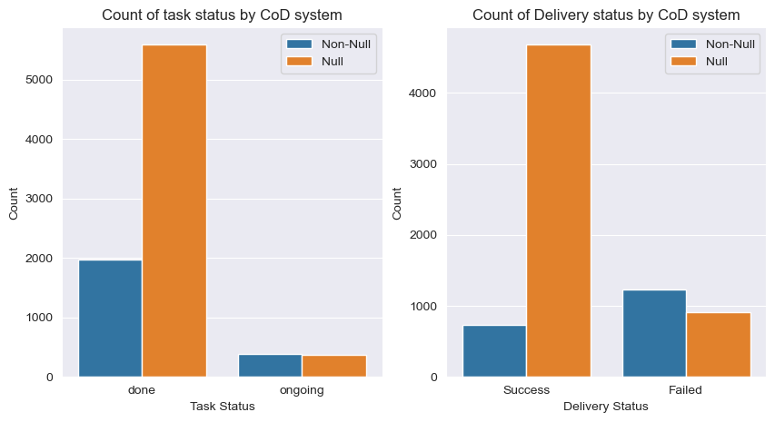
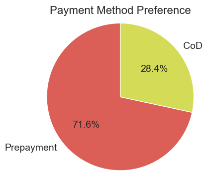
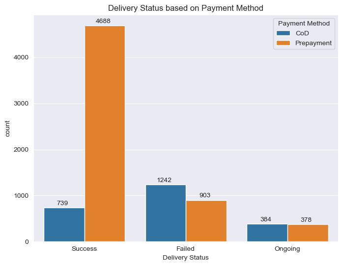
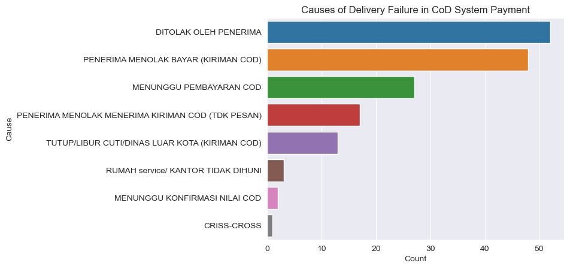
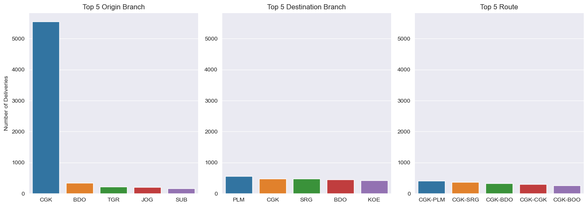
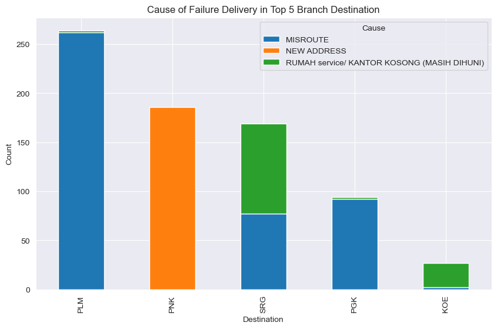
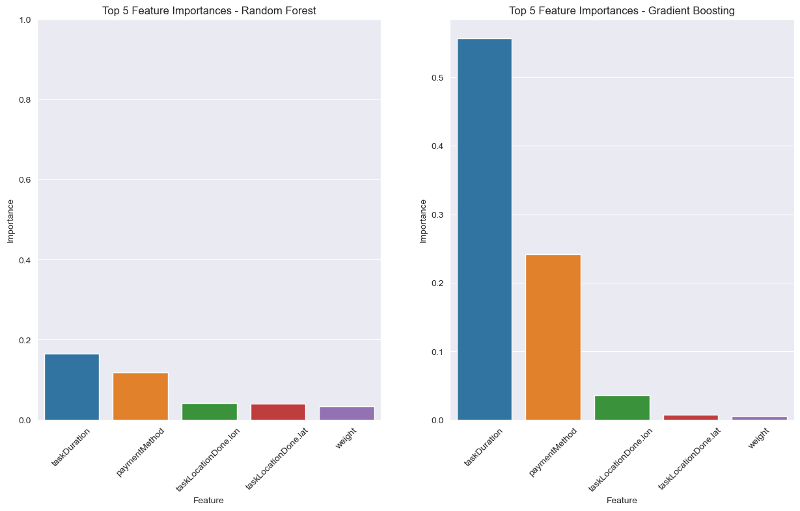

# Data Insights Report

## Introduction
This report provide any insight that I found through data analysis. The [dataset](https://github.com/indrasetiadhip/data-task-sample) I analyze contains information about delivery task within 10 days of work.
- - - -

## Additional Findings

### Relationship Between Ongoing Task with Null Entries in the Dataset

`sns.barplot()` used here to see the relationship of to categorical field/variable in the dataframe. X axis is the _taskStatus_ which gives information about current situation of the task. _taskStatus_ has 2 values: 
- **done**: the task is completed
- **ongoing**: the task still on progress

The y axis shows the number of all entries including null entries from other column shown at each of the plot legend. **Blue** bar represent **Non-Null** entry, while **orange** bar represent **Null** entry. Based from this visualization, **every Null entry lies on ongoing task**. 

So, I can assume that **Null entry in the data is because the task is not yet completed**. Therefore, it is safer to consider dropping these Null rows rather than fill it with incorrect assumptions.

### CoD Field relation to Task Status and Delivery Status

In the above barplot the **blue bars** indicate **Non-Null** entries while the **orange bars** indicate **Null entries**. the barplot shows relationship of _CoD system_ from _cod_ field with _Task Status_ from _taskStatus_ column and _Delivery Status_ from _UserVar.taskStatusLabel_ column.

From this information we can see that there are many null entries in the cod system even though the _Task Status_ is _done_. In addition, the _Success_ Delivery Status mostly contains Null data and some _Failed_ Delivery Status also contains Null data on the CoD System.

Since most of delivery is already completed (failed delivery are considered complete), then the reason is high-likely because:
1. ~~tasks are still ongoing as in the Null analysis above, so information is not yet available.~~
2. entry intentionally left blank due to the use of other payment systems other than CoD System

From this conclusion I decided to create a new set of column that provides additional information 
- - - -

## Key Insights

### Payment Method Preference, Success Rate, and Failure Case
#### Payment Preference

_Pie Chart_ above shows customer(user) payment method preference. 
**71.6% of 8334 customer prefer to use Prepayment** method to pay for their package while the rest **28.4% prefer to use CoD system**. Now, we have to look which payment methods are better for the company.

#### Success Rate and Failure Rate

Since there are no data about amount of money received from prepayment payment method. I used the package delivery success rate based on the payment type used. Based on the barplot above, the following information is obtained:
1. There were 4688 successful deliveries out of 5976 deliveries using prepayment -- **(Success Rate: 78.44%)**
2. There were 739 successful deliveries out of 2358 deliveries using CoD -- **(Success Rate: 31.34%)**
3. There were 910 delivery failure using prepayment -- **(Failure Rate: 15.23%)**
4. There were 1235 delivery failure using CoD -- **(Failure Rate: 52.37%)**
5. while the rest deliveries are still ongoing

From this information we can see that Prepayment method has higher delivery Success Rate with lower Failure than CoD. So, **Prepayment will be much more beneficial for the company** since it has has lower risk percentage

#### Top Cause of CoD delivery Failure

__The Barplot__ above shows the causes of delivery failures that are only found in the CoD payment system. It can be seen in some cases, the customer refuses to accept the package or even refuses to pay for the package.
This is the reason why prepayment has higher success rate, while CoD has higher failur rate

### Delivery Branch Performance
#### Top 5 origin, Destination and Route

__barplots__ above shows that the CGK branch is the highest package delivery branch with more than 5000 deliveries far above the other branches. While the top 5 destination branches are more evenly distributed as shown in __Top 5 Destination Branch Barplot__. The __Top 5 Route__ barplot also showed the same, but the top 5 route to do deliveries are all started from CGK branch

from this information there are several strategies that can be taken to improve business efficiency and effectiveness, including:
1. Improve logistics by increasing units and services at the CGK branch
2. Optimize inventory management at branches of origin or branches of destination that have high delivery intensity to ensure that the business can meet demand
3. Optimize delivery route by finding the most effiecient route to deliver package especially the most used routes as shown in the chart above

#### Main cause of Failure in Top 5 Most Failed Delivery Task

__Stacked Bar Chart__ above shows top 5 branch destination with the most failed delivery case. There are 3 different color used in this chart.
- **Blue** represent number of fail case due to Misroute problem
- **Orange** represent number of fail case due to the user new address
- **Green** represent number of fail case due to empty house/office (no recipient)

From this chart we can see that Misrouting is causing big trouble in PLM, SRG and PGK branch. Misrouting can be caused by errors in the system, operational issues, track conditions, or human error. Meanwhile, new address problems and empty house/office problems generally occur due to human error. These three problems can be prevented or mitigated by the company with these solutions:
1. Company needs to verify user address by using online address verification services
2. Improve communication with customers by providing regular updates on the status of their packages.
3. Company can develop mapping tools to plan the most efficient routes, and reducing the risk of misrouting due to closed road. This tools can also help to track packages, allowing corrective action to be taken before the package is lost or delivered to the wrong address

## Key Insight using Machine Learning
### Delivery Time and Payment Method Determine Delivery Success

I use Feature Selection with Random Forest and Gradient Boost Classiefier algorithm to look on the most impactful factor of success in delivery. __taskStatusLabel__ used as the target variable for feature selection, so that we can see what factors are the best to estimate wether the delivery will be **success** or **fail**.

`rf_top_5 = feature_importances['Random Forest'].head(5)`

`gb_top_5 = feature_importances['Gradient Boosting'].head(5)`

Top 5 factor from random forest and top 5 factor from gradient boost stored in a variable each. Then these variable plotted using __barplot__ to see what factor is the most determinant for the delivery success.

The feature selection results displayed on the barplot with the __Random Forest__ and __Gradient Boost__ algorithms show similarities, where taskDuration has the highest level of importance, followed by paymentMethod even though the import value is different.

Meanwhile, there are differences in the importance of the other 3 predictors seen from both algorithms. This means that **taskDuration and paymentMethod can be reliable predictors** in predicting taskStatus.

Based on this information, it can be concluded that the success rate of package delivery can be improved by preventing problems that affect the duration of delivery and optimizing payment methods in accordance with the results of the analysis that has been carried out. In addition, companies can also predict the success rate of delivery with algorithms based on the two predictors.
- - -
